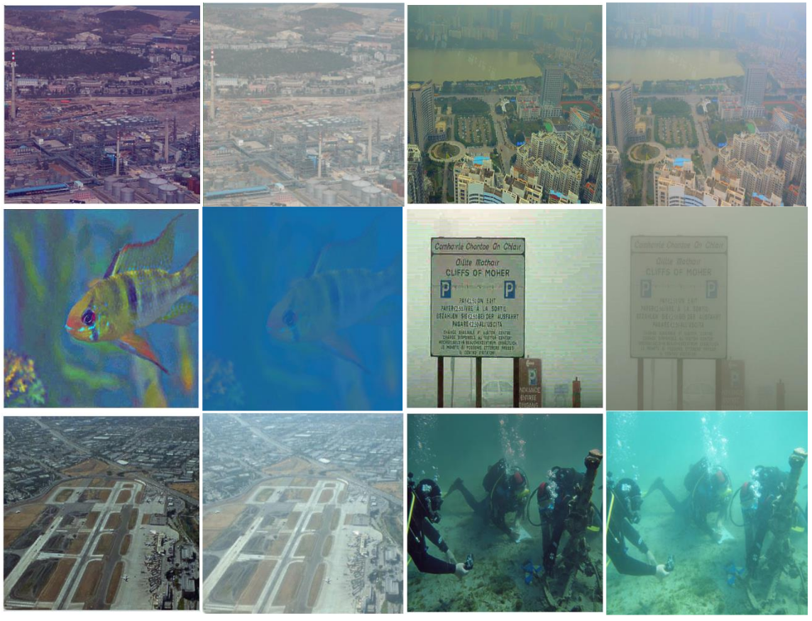
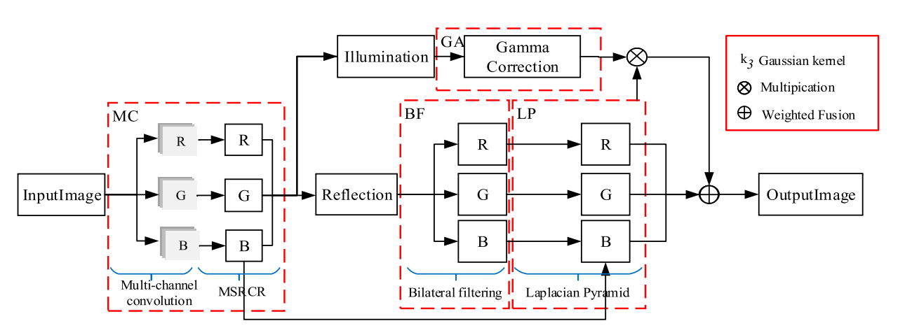

# Retinex-Based Laplacian Pyramid Method for Image Defogging

### Overview

This project implements the **Retinex-Based Laplacian Pyramid Method for Image Defogging** as described in the IEEE paper, "[Retinex-Based Laplacian Pyramid Method for Image Defogging (IEEE Xplore)](https://ieeexplore.ieee.org/document/8796366)". The approach combines multi-scale Retinex techniques with Laplacian pyramid decomposition to enhance and defog images effectively. It simulates the human visual system by correcting non-uniform illumination and integrating local detail enhancements.

---
### Example results 



---

### Project Components

- **Main Python Script (`defog.py`):**  
  Implements the complete defogging algorithm:
  - Multi-scale Retinex (MSR)
  - Color Restoration Function (CRF)
  - Bilateral Filtering for edge preservation
  - Laplacian Pyramid for detail enhancement
  - Gamma Correction for brightness adjustment

- **Jupyter Notebook (`notebook.ipynb`):**  
  Provides a step-by-step demonstration and explanation of the defogging process.

- **Example Output (`output.png`):**  
  A sample image showcasing the defogging results.

---

### Installation & Setup

1. **Prerequisites:**  
   Ensure you have Python 3.6+ installed. Install the required libraries:
   ```bash
   pip install numpy opencv-python scikit-image matplotlib Pillow
   ```

2. **Clone the Repository:**  
   Run the following commands in your terminal:
   ```bash
   git clone https://github.com/your-username/retinex-defogging.git
   cd retinex-defogging
   ```

---

### How to Use

#### Running the Defogging Script
- **Update** the `image_path` in `defog.py` to point to your target image.
- **Execute** the script:
  ```bash
  python defog.py
  ```
- The script will process the image, display the result in a new window, and save the enhanced image as `output.png`.

#### Working with the Jupyter Notebook
- Launch the notebook with:
  ```bash
  jupyter notebook
  ```
- Open `notebook.ipynb` and follow the interactive instructions to understand and tweak the defogging process.

---

### Code Structure Breakdown



- **Image Preprocessing:**  
  Conversion to floating-point format and scaling for stability.
  
- **Multi-Scale Retinex (MSR):**  
  Applies Gaussian blurring at multiple scales to extract illumination details.

- **Color Restoration (CRF):**  
  Adjusts logarithmic differences to maintain accurate color balance.

- **Bilateral Filtering:**  
  Smooths the image while preserving important edges.

- **Laplacian Pyramid Decomposition:**  
  Enhances local details through pyramid-based image reconstruction.

- **Gamma Correction:**  
  Applies adaptive brightness correction based on image statistics.

---

### References

- [Retinex-Based Laplacian Pyramid Method for Image Defogging (IEEE Xplore)](https://ieeexplore.ieee.org/document/8796366)

---

### License

  This project is licensed under the MIT License. See the `LICENSE` file for details.
